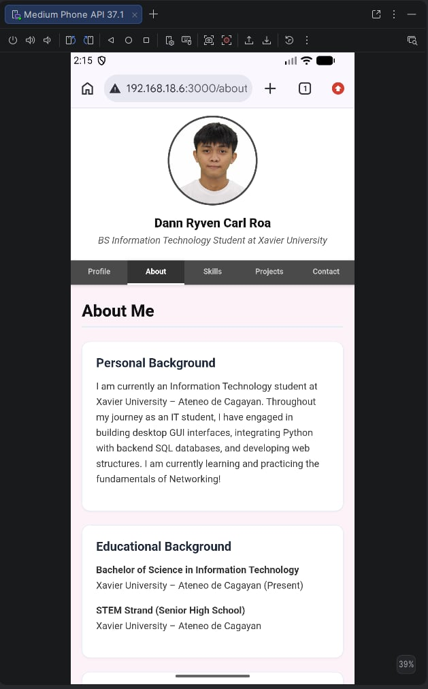
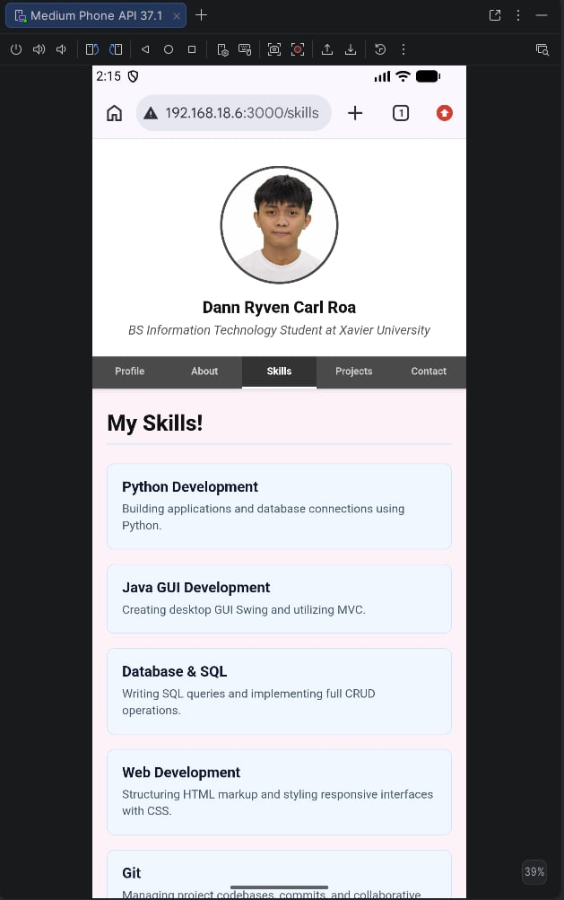
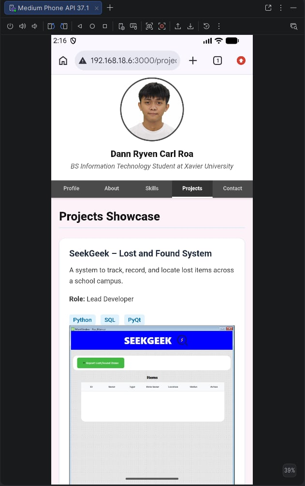
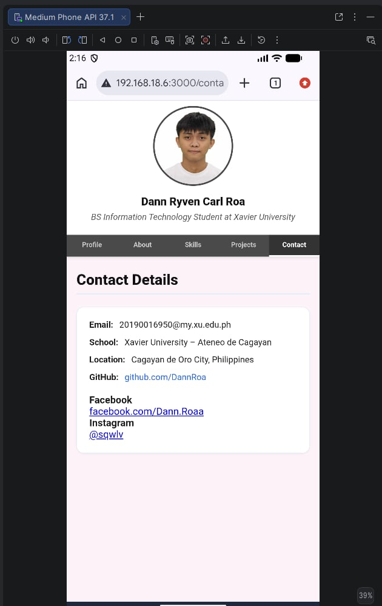
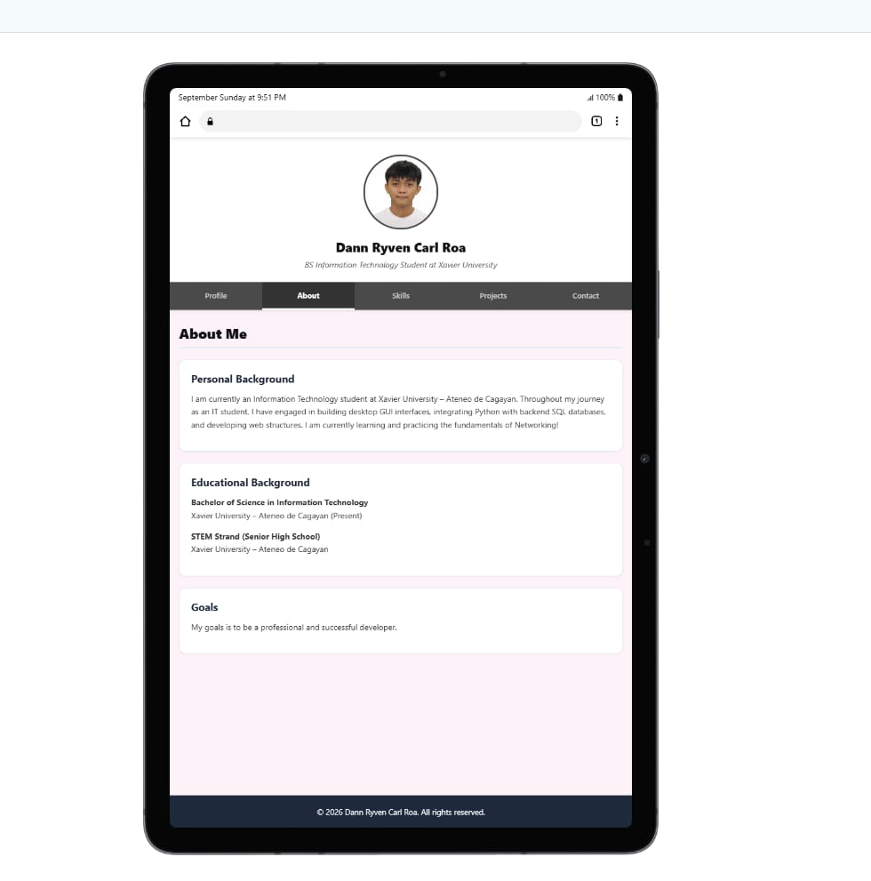
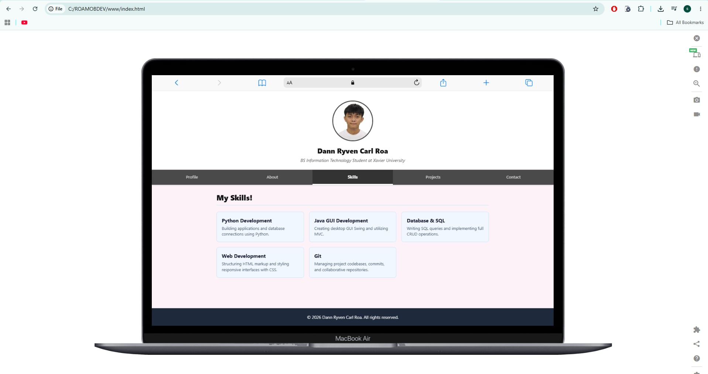

# Multi-Page Student Profile Application

## 1. Project Description
This is my expanded multi-page student profile. Here, you can now move easily from page to page. Instead of putting all my information at one page, you can now navigate more from the website, now it's easy to use.

## 2. Application Pages
- **Profile (index.html):** This is my primary homepage. It features my profile picture, name, introductory bio, and primary navigation.
- **About (about.html):** Displays my full personal background, educational achievements at Xavier University – Ateneo de Cagayan, and career goals.
- **Skills (skills.html):** This highlights my technical skills.
- **Projects (projects.html):** It features my three completed projects, including SeekGeek, StreamLine X, and an MVC Calculator.
- **Contact (contact.html):** This contains all my contact info including a link to my GitHub and social medias.

## 3. Navigation
Navigation is handled using HTML hyperlink tags (`<a href="...">`). This allows all five pages to traverse between screens without relying on JavaScript.

## 4. Responsive Design
I applied @media (min-width: 1500px) rules to switch my layout from a stacked single column into a multi-column desktop grid for wider displays. I also included the meta viewport tag (width=device-width, initial-scale=1) to adjust scaling properly on mobile browsers.

## 5. UI/UX Principles Applied
- **Consistency:** Uniform typography, button states, and spacing models.
- **Visual Hierarchy:** Distinct headings and structured container cards.
- **Usability & Accessibility:** Active page navigation, clear link targets and semantic structural tags.


### Screenshots

### Profile Page


### About Page


### Skills Page


### Projects Page


### Contacts Page


### Tablet


### Desktop


## 6. How to Build & Run
```bash

npm install -g cordova

cordova platform add android

cordova build android

cordova emulate android

#to run in android studio (if not open)
npx server

#open either local or network !!
