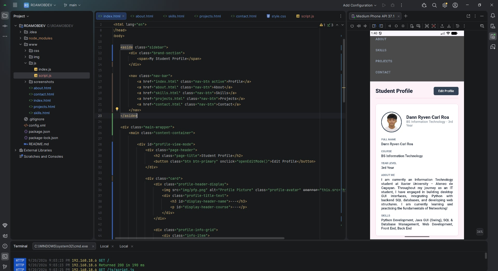
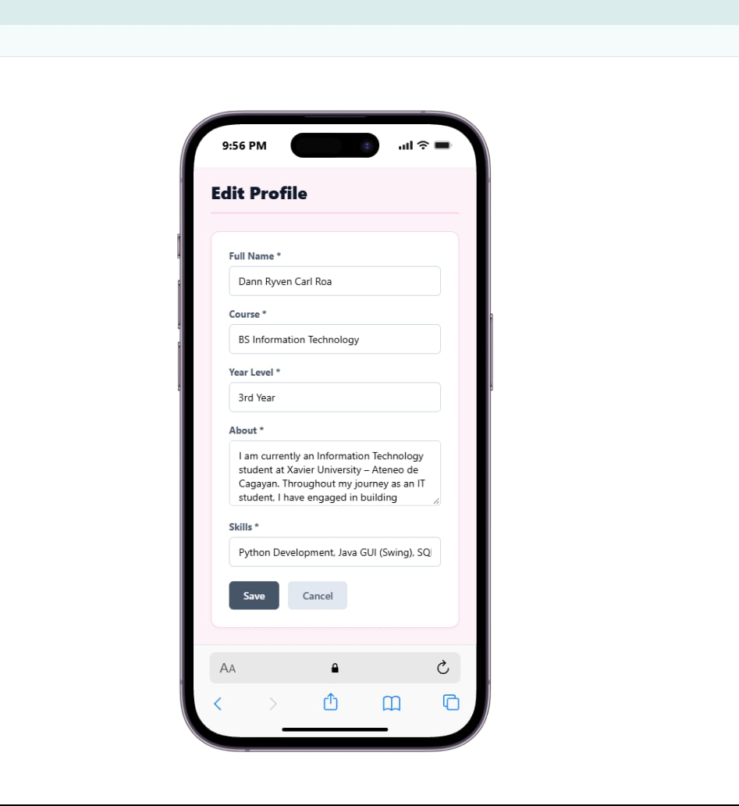
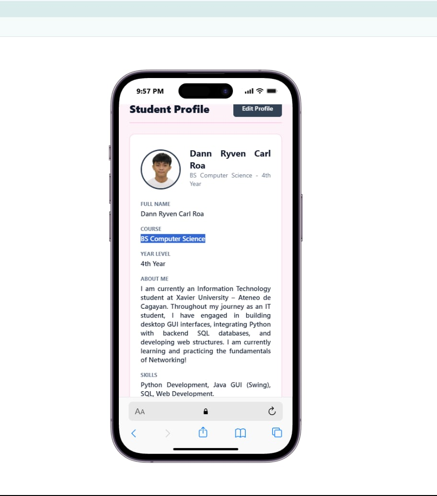
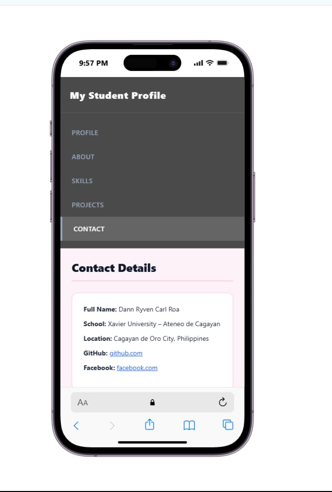

# Updated Student Profile Application (Edit Profile Feature)- Activity 5

## 1. Project Description
This is my newly updated student profile. I have added a Edit Profile button, and the application displays an editing interface, this allows to modify my profile information.

## 2. Application Pages
* **Profile (`index.html`)**: This displays my primary student identification, educational background, and this is where the interactive **Edit Profile** feature.
* **About (`about.html`)**: This features personal background, it is synced with profile edits and educational background.
* **Skills (`skills.html`)**: This displays my profile skills and dynamically renders individual skill cards based on user inputs.
* **Projects (`projects.html`)**: This showcases my academic projects.
* **Contact (`contact.html`)**: This is all my contact details, school information, location, github and social media links.

## 3. Profile Editing
The **Edit Profile** feature enables user to update informations in real time:
* Full Name
* Course
* Year Level
* About Me
* Skills (comma-separated)

Updating information instantly syncs and reflects the updated content across the Profile, About and Skills section.

## 4. JavaScript Functionality
JavaScript (`js/script.js`) powers the application logic:
* **Form Handling:** This manages switching between View Mode and Edit Mode without page reloads.
* **Validation:** It ensures required fields are populated before saving, displaying error alerts if validation fails.
* **Profile Updates:** Re-renders DOM elements dynamically across all pages upon saving.
* **Dynamic Skill Cards:** Splits comma-separated skills into array items and dynamically generates HTML skill cards for each item on the Skills page.
* **Save & Cancel:** Saves validated input to persistent storage or reverts changes back to the last saved state when cancelled.

## 5. Local Data Storage
The application utilizes `localStorage` (`student_profile_data`) to persist user profile updates locally in the browser/device storage.

## 6. Responsive Design
I applied @media (min-width: 1500px) rules to switch my layout from a stacked single column into a multi-column desktop grid for wider displays. I also included the meta viewport tag (width=device-width, initial-scale=1) to adjust scaling properly on mobile browsers.

## Screenshots

### Student Profile

### Edit Profile

### Updated Profile

### Contact

## 7. How to Run
npm install -g cordova

cordova platform add android

cordova build android

cordova emulate android

#to run in android studio (if not open)
npx server

# open either local or network !!
