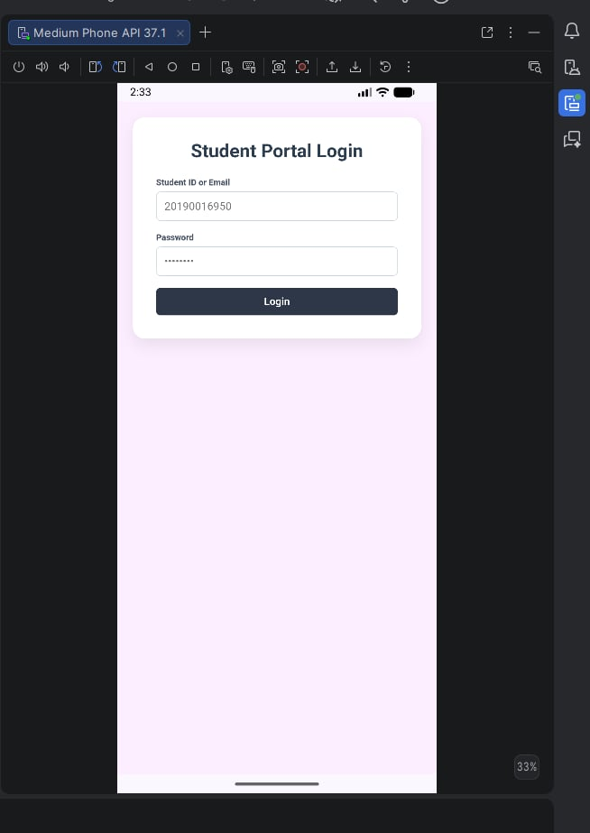

# Student Profile Application (Database-Driven Mobile App)

## 1. Project Description
This is my newly updated Student Profile Application.The application now features full backend authentication, persistent student profile storage, real-time profile editing, camera integration, and mobile-friendly styling.

---

## 2. Application Pages & Features
* **Login Screen:** The initial gateway to the app. Authenticates students using their Student ID/Email and password before providing access to protected profile data.
* **Profile (`index.html`):** This displays all my information Name, Course, Year lvl, About me, and Skills. It features a toggleable "Edit Profile" mode and interactive camera upload.
* **About (`about.html`):** This summarizes my background.
* **Skills (`skills.html`):** This shows my technical skill sets.
* **Projects (`projects.html`):** This features my academic projects I built.
* **Contact (`contact.html`):**  This is where all my contact info.

---

## 3. Authentication
Users login by providing Id and password.

* **Workflow:** `Login Screen` → `Post Credentials to Backend` → `Verify & Sign JWT` → `Store Token in LocalStorage` → `Load Protected Student Profile`
* When launching the application without a valid token, users are immediately presented with the **Student Portal Login**.

---

## 4. Student Profile Management
Authenticated students can perform:

* **View Profile:** View personal details, education background, bio, skills, and profile photo loaded directly from SQLite.
* **Edit Information:** Click **Edit Profile** to toggle an inline form where Name, Course, Year Level, Bio, and Skills can be modified.
* **Save Changes:** Submit the form to perform a backend update (`PUT /api/profile`), immediately re-rendering the updated details across all pages.
* **Update Profile Picture:** Tap the profile photo circle to open a modal options popup. Take a live photo or choose from gallery using `navigator.camera` (or file picker fallback in browser environments). The captured image is converted to Base64 and stored in SQLite.
* **Log Out:** Click the **Log Out** button located in the sidebar drawer of any page to clear `localStorage` tokens and return to the login screen.

---

## 5. Database Integration
The backend utilizes **SQLite** (`sqlite3`) as its relational database. The application maintains a `students` table structured as follows:

| `id` | INTEGER PRIMARY KEY | Unique auto-incrementing student record ID 
| `student_id` | TEXT UNIQUE | Student ID number used for portal login 
| `email` | TEXT UNIQUE | Student email address 
| `password_hash` | TEXT | Hashed password string 
| `name` | TEXT | Full name of the student 
| `course` | TEXT | Enrolled academic program 
| `year_level` | TEXT | Current year level 
| `bio` | TEXT | Personal "About Me" description 
| `skills` | TEXT | Comma-separated list of technical/soft skills 
| `profile_picture` | TEXT | Base64-encoded Data URL string of the user avatar 

---

## 6. API & Backend Architecture
Communication follows a RESTful client-server architecture:
Cordova Mobile App > HTTP/REST API Request > Express.js backend server > SQL Queries > SQLite Database

### API Endpoints

* `POST /api/login`: Validates credentials and returns a JWT token.
* `GET /api/profile`: Protected endpoint. Retrieves the profile record corresponding to the decoded JWT student ID.
* `PUT /api/profile`: Protected endpoint. Updates profile fields or avatar base64 data in SQLite.

---

## 7. CRUD Operations
The application supports the full CRUD lifecycle for student records:

* **Create:** On backend initialization, missing default student records are seeded into the SQLite database.
* **Read:** `GET /api/profile` fetches student records from SQLite and populates elements across `index.html`, `about.html`, `skills.html`, and `contact.html`.
* **Update:** `PUT /api/profile` updates student fields (Name, Course, Year Level, Bio, Skills, and Base64 Avatar) in the database upon form submission or photo capture.
* **Delete:** Executing a session clear upon logout destroys active JWT session state, restricting unauthorized access to student records.

---

## 8. Camera Integration
I used the cordova-plugin-camera to interact with the camera hardware.

* Tapping the profile avatar triggers a custom option modal ("Take Photo", "Choose Photo", "Cancel").
* Native mobile execution uses Apache Cordova's `navigator.camera.getPicture()` to capture standard JPEG representations (`DATA_URL`).
* Browsers and emulator environments gracefully fall back to an hidden `<input type="file" accept="image/*">` picker using `FileReader`.
* Base64 image strings are pushed to SQLite (`PUT /api/profile`), ensuring new avatar uploads persist permanently across app restarts.

---

## 9. Data Persistence
Profile edits and custom photos remain permanently saved because:

* **Backend:** All updates are written directly to the persistent SQLite database file (`database.sqlite`).
* **Session Handling:** Authentication tokens (`jwt_auth_token`) are retained in `localStorage` so users remain logged in across page navigations without session loss.
* **App Restart:** Restarting the app re-authenticates the stored token against the backend SQLite database to fetch the latest state.

---

## 10. Responsive Design
The user interface is designed using flexible CSS viewports (`viewport-fit=cover`), flexbox containers, and responsive drawers:

* **Mobile (Android/iOS):** Displays fixed header bars, drawer menu toggles, single-column profile cards, and full-screen modals tailored for touch devices.
* **Tablets & Desktop:** Smoothly scales card containers, navigation panels, and projects grids without breaking alignment or horizontal overflow.

---

## 11. Security Measures
Security practices applied in this project:

* **Password Security:** Passwords are hashed before storage in the database. Plaintext passwords are never saved.
* **Credential Isolation:** Database connection details and JWT secret keys reside strictly on the backend Node.js server.
* **No Database Exposure:** The Cordova client cannot access the database directly; all interactions go through protected API endpoints.
* **Token Protection:** API requests require valid `Authorization: Bearer <token>` headers signed by the backend.

---

## 12. How to Run the Application
npm install -g cordova

cordova platform add android

cordova build android

cordova prepare android

Open a terminal and navigate to your backend directory 

cd server

cordova run android

## SCREENSHOTS
# Login Page

# Sucessful login & Student Profile

# Edit Profile

# Updated Profile

# Camera

# Logout 

# Database Functionality
